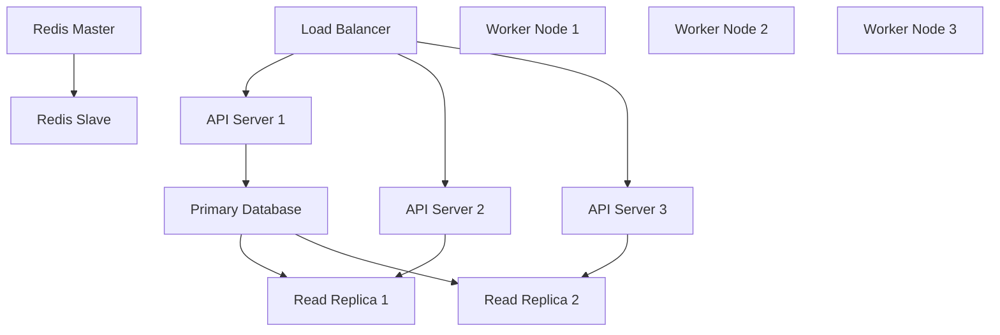

# 🚨 Disaster Recovery & Business Continuity

## Overview

Comprehensive disaster recovery strategy for the causal evaluation framework, ensuring minimal downtime and data loss in catastrophic scenarios while maintaining business continuity.

## 🎯 Recovery Objectives

### Recovery Time Objective (RTO)
- **Critical Services**: 15 minutes
- **Standard Services**: 1 hour  
- **Non-critical Services**: 4 hours
- **Full System Recovery**: 24 hours

### Recovery Point Objective (RPO)
- **Database**: 5 minutes (continuous replication)
- **File Storage**: 15 minutes (incremental backups)
- **Configuration**: 1 hour (automated snapshots)
- **Code Repositories**: Real-time (distributed Git)

## 🏗️ Architecture Resilience

### Multi-Region Deployment
```yaml
regions:
  primary:
    location: "us-east-1"
    services: ["api", "database", "cache", "worker"]
    capacity: "100%"
    
  secondary:
    location: "us-west-2"
    services: ["api", "database-replica", "cache", "worker"]
    capacity: "50%"
    
  disaster_recovery:
    location: "eu-west-1"
    services: ["cold-standby"]
    capacity: "25%"
```

### High Availability Components


## 💾 Backup Strategy

### Database Backups
```sql
-- Automated backup configuration
SELECT pg_start_backup('disaster_recovery_backup');

-- Point-in-time recovery setup
archive_mode = on
archive_command = 'gzip < %p > /backup/wal/%f.gz'
wal_level = replica

-- Backup retention policy
backup_retention_days = 30
point_in_time_recovery_days = 7
```

### Application Backups
```python
import asyncio
import asyncpg
from datetime import datetime
import boto3

class BackupManager:
    def __init__(self):
        self.s3_client = boto3.client('s3')
        self.bucket_name = 'causal-eval-backups'
    
    async def create_database_backup(self):
        """Create full database backup."""
        timestamp = datetime.utcnow().strftime('%Y%m%d_%H%M%S')
        backup_name = f"database_backup_{timestamp}.sql"
        
        # Create backup
        conn = await asyncpg.connect(DATABASE_URL)
        backup_data = await conn.fetch("SELECT * FROM pg_dump();")
        await conn.close()
        
        # Upload to S3
        self.s3_client.put_object(
            Bucket=self.bucket_name,
            Key=f"database/{backup_name}",
            Body=backup_data
        )
        
        return backup_name
    
    async def backup_application_state(self):
        """Backup application configuration and state."""
        state_data = {
            'configuration': await self.get_configuration(),
            'user_sessions': await self.get_active_sessions(),
            'model_cache': await self.get_model_cache_state(),
            'evaluation_queue': await self.get_queue_state()
        }
        
        timestamp = datetime.utcnow().strftime('%Y%m%d_%H%M%S')
        backup_name = f"app_state_{timestamp}.json"
        
        self.s3_client.put_object(
            Bucket=self.bucket_name,
            Key=f"application/{backup_name}",
            Body=json.dumps(state_data)
        )
```

### Backup Automation
```yaml
# Backup schedule configuration
backups:
  database:
    full_backup:
      schedule: "0 2 * * *"  # Daily at 2 AM
      retention: 30
    incremental_backup:
      schedule: "*/15 * * * *"  # Every 15 minutes
      retention: 7
      
  application:
    configuration:
      schedule: "0 */6 * * *"  # Every 6 hours
      retention: 14
    state:
      schedule: "*/30 * * * *"  # Every 30 minutes
      retention: 3
      
  monitoring:
    metrics:
      schedule: "0 1 * * *"  # Daily at 1 AM
      retention: 90
    logs:
      schedule: "0 0 * * 0"  # Weekly
      retention: 365
```

## 🔄 Failover Procedures

### Automatic Failover
```python
class FailoverManager:
    def __init__(self):
        self.health_checker = HealthMonitor()
        self.dns_manager = DNSManager()
        self.load_balancer = LoadBalancerManager()
    
    async def monitor_primary_region(self):
        """Continuously monitor primary region health."""
        while True:
            try:
                health_status = await self.health_checker.check_all_services()
                
                if not health_status.all_healthy:
                    await self.initiate_failover(health_status)
                
                await asyncio.sleep(30)  # Check every 30 seconds
                
            except Exception as e:
                logger.error(f"Health check failed: {e}")
                await self.initiate_emergency_failover()
    
    async def initiate_failover(self, health_status):
        """Initiate failover to secondary region."""
        logger.critical("Initiating failover to secondary region")
        
        # 1. Stop traffic to primary region
        await self.load_balancer.drain_traffic('primary')
        
        # 2. Promote secondary database to primary
        await self.promote_secondary_database()
        
        # 3. Update DNS to point to secondary region
        await self.dns_manager.update_records('secondary')
        
        # 4. Start services in secondary region
        await self.start_secondary_services()
        
        # 5. Verify failover success
        await self.verify_failover()
        
        logger.info("Failover completed successfully")
```

### Manual Failover Process
```bash
#!/bin/bash
# Manual failover script for emergency situations

set -euo pipefail

echo "🚨 EMERGENCY FAILOVER INITIATED"
echo "Timestamp: $(date)"

# 1. Stop primary region traffic
echo "Stopping traffic to primary region..."
kubectl patch service api-service -p '{"spec":{"selector":{"version":"maintenance"}}}'

# 2. Create final backup
echo "Creating emergency backup..."
pg_dump "$PRIMARY_DB_URL" | gzip > "emergency_backup_$(date +%Y%m%d_%H%M%S).sql.gz"

# 3. Promote secondary database
echo "Promoting secondary database..."
pg_ctl promote -D /var/lib/postgresql/data

# 4. Update DNS records
echo "Updating DNS to secondary region..."
aws route53 change-resource-record-sets \
  --hosted-zone-id "$HOSTED_ZONE_ID" \
  --change-batch file://failover-dns-change.json

# 5. Scale up secondary region
echo "Scaling up secondary region..."
kubectl scale deployment api-deployment --replicas=6
kubectl scale deployment worker-deployment --replicas=4

# 6. Verify services
echo "Verifying services..."
curl -f "$SECONDARY_REGION_URL/health" || exit 1

echo "✅ Failover completed successfully"
echo "Primary region is now offline"
echo "Secondary region is serving traffic"
```

## 🔧 Recovery Procedures

### Database Recovery
```python
class DatabaseRecovery:
    def __init__(self):
        self.backup_manager = BackupManager()
        self.connection_pool = None
    
    async def point_in_time_recovery(self, target_time: datetime):
        """Perform point-in-time recovery to specific timestamp."""
        logger.info(f"Starting PITR to {target_time}")
        
        # 1. Stop database
        await self.stop_database_safely()
        
        # 2. Restore base backup
        base_backup = await self.get_latest_base_backup(target_time)
        await self.restore_base_backup(base_backup)
        
        # 3. Apply WAL files up to target time
        await self.replay_wal_files(target_time)
        
        # 4. Start database
        await self.start_database()
        
        # 5. Verify recovery
        await self.verify_database_integrity()
        
        logger.info("PITR completed successfully")
    
    async def full_restore_from_backup(self, backup_name: str):
        """Restore database from full backup."""
        logger.info(f"Restoring from backup: {backup_name}")
        
        # Download backup from S3
        backup_data = await self.backup_manager.download_backup(backup_name)
        
        # Stop current database
        await self.stop_database_safely()
        
        # Restore data
        await self.execute_restore(backup_data)
        
        # Start database
        await self.start_database()
        
        # Update statistics
        await self.update_database_statistics()
        
        logger.info("Database restore completed")
```

### Application Recovery
```python
class ApplicationRecovery:
    def __init__(self):
        self.container_manager = ContainerManager()
        self.config_manager = ConfigManager()
    
    async def restore_application_state(self, state_backup: str):
        """Restore application to previous state."""
        # Download state backup
        state_data = await self.download_state_backup(state_backup)
        
        # Restore configuration
        await self.config_manager.restore_configuration(
            state_data['configuration']
        )
        
        # Restore user sessions
        await self.restore_user_sessions(state_data['user_sessions'])
        
        # Restore model cache
        await self.restore_model_cache(state_data['model_cache'])
        
        # Restore evaluation queue
        await self.restore_evaluation_queue(state_data['evaluation_queue'])
        
        logger.info("Application state restored successfully")
    
    async def rolling_restart(self):
        """Perform rolling restart of application services."""
        services = ['api', 'worker', 'scheduler']
        
        for service in services:
            logger.info(f"Restarting {service} service")
            
            # Scale down old instances gradually
            await self.container_manager.scale_service(service, 0.5)
            await asyncio.sleep(30)
            
            # Deploy new instances
            await self.container_manager.deploy_service(service)
            await asyncio.sleep(60)
            
            # Verify health
            await self.verify_service_health(service)
            
            logger.info(f"{service} service restarted successfully")
```

## 🧪 Disaster Recovery Testing

### Automated DR Tests
```yaml
# DR testing schedule
dr_tests:
  failover_test:
    schedule: "0 3 1 * *"  # Monthly at 3 AM on 1st
    duration: "2h"
    scope: ["database_failover", "application_failover"]
    
  backup_restore_test:
    schedule: "0 2 */2 * *"  # Every other day at 2 AM
    duration: "30m"
    scope: ["database_restore", "config_restore"]
    
  full_dr_simulation:
    schedule: "0 4 1 */3 *"  # Quarterly on 1st at 4 AM
    duration: "4h"
    scope: ["complete_disaster_simulation"]
```

### DR Test Implementation
```python
class DisasterRecoveryTester:
    def __init__(self):
        self.test_environment = TestEnvironment()
        self.metrics_collector = MetricsCollector()
    
    async def run_failover_test(self):
        """Test complete failover procedure."""
        test_start = datetime.utcnow()
        
        try:
            # 1. Create test load
            await self.test_environment.generate_load()
            
            # 2. Simulate primary region failure
            await self.test_environment.simulate_failure('primary')
            
            # 3. Measure failover time
            failover_start = datetime.utcnow()
            await self.initiate_test_failover()
            failover_end = datetime.utcnow()
            
            # 4. Verify secondary region is serving traffic
            await self.verify_secondary_region_health()
            
            # 5. Measure recovery metrics
            rto_actual = (failover_end - failover_start).total_seconds()
            
            # 6. Restore primary region
            await self.restore_primary_region()
            
            # 7. Generate test report
            await self.generate_test_report({
                'test_type': 'failover',
                'rto_target': 900,  # 15 minutes
                'rto_actual': rto_actual,
                'success': rto_actual < 900,
                'timestamp': test_start
            })
            
        except Exception as e:
            logger.error(f"DR test failed: {e}")
            await self.emergency_cleanup()
```

## 📊 Recovery Metrics & SLAs

### Key Performance Indicators
```python
dr_metrics = {
    'rto_compliance': {
        'critical_services': 0.95,  # 95% within 15 minutes
        'standard_services': 0.98,  # 98% within 1 hour
        'target': '>95%'
    },
    'rpo_compliance': {
        'database': 0.99,  # 99% within 5 minutes
        'files': 0.95,     # 95% within 15 minutes
        'target': '>95%'
    },
    'backup_success_rate': {
        'current': 0.999,
        'target': '>99.9%'
    },
    'recovery_success_rate': {
        'current': 0.98,
        'target': '>95%'
    }
}
```

### Monitoring & Alerting
```yaml
alerts:
  backup_failure:
    condition: "backup_success_rate < 0.99"
    severity: "critical"
    action: "immediate_investigation"
    
  rto_violation:
    condition: "recovery_time > rto_target"
    severity: "high"
    action: "process_review"
    
  rpo_violation:
    condition: "data_loss > rpo_target"
    severity: "critical"
    action: "incident_response"
    
  dr_test_failure:
    condition: "dr_test_success_rate < 0.9"
    severity: "medium"
    action: "procedure_review"
```

## 📋 Runbooks

### Emergency Response Checklist
```markdown
## 🚨 Emergency Response Checklist

### Immediate Actions (0-5 minutes)
- [ ] Assess scope and impact of disaster
- [ ] Notify incident response team
- [ ] Activate emergency communication channels
- [ ] Begin impact mitigation procedures

### Short-term Actions (5-30 minutes)
- [ ] Execute automated failover if appropriate
- [ ] Verify backup systems are functioning
- [ ] Communicate status to stakeholders
- [ ] Begin manual recovery procedures if needed

### Recovery Actions (30 minutes - 24 hours)
- [ ] Execute full recovery procedures
- [ ] Verify data integrity and completeness
- [ ] Resume normal operations gradually
- [ ] Monitor system stability

### Post-Incident Actions (24+ hours)
- [ ] Conduct post-mortem analysis
- [ ] Update disaster recovery procedures
- [ ] Test improved procedures
- [ ] Report to stakeholders
```

## 🎯 Success Criteria

### Recovery Objectives Achievement
- **RTO Compliance**: >95% of incidents recovered within target time
- **RPO Compliance**: >95% of data recovered within acceptable loss window
- **Backup Reliability**: >99.9% successful backup completion rate
- **DR Test Success**: >90% of disaster recovery tests pass completely

### Business Continuity Metrics
- **Service Availability**: >99.9% uptime including disaster scenarios
- **Customer Impact**: <5% customer impact during disaster recovery
- **Revenue Protection**: <1% revenue loss during disaster scenarios
- **Compliance**: 100% regulatory compliance maintained during recovery

This comprehensive disaster recovery strategy ensures business continuity and minimizes impact from catastrophic events while maintaining the highest standards of data protection and service availability.